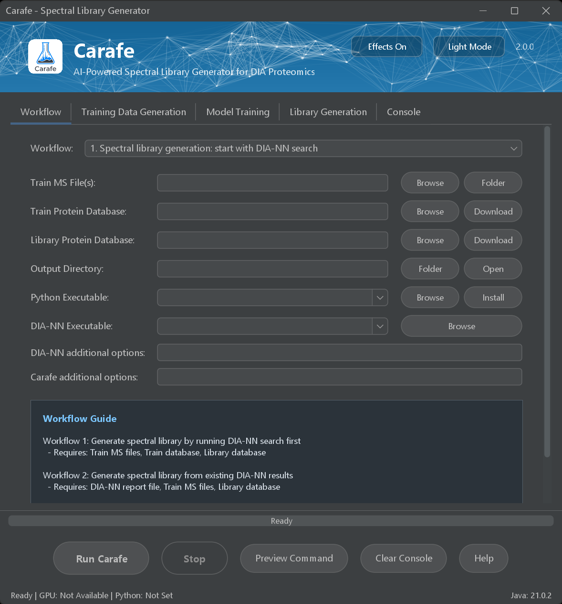
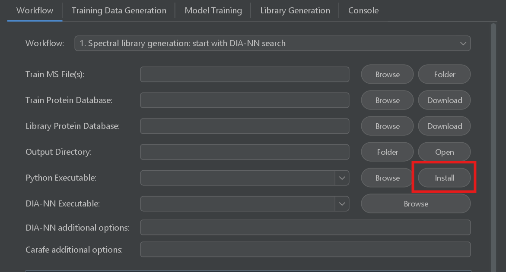
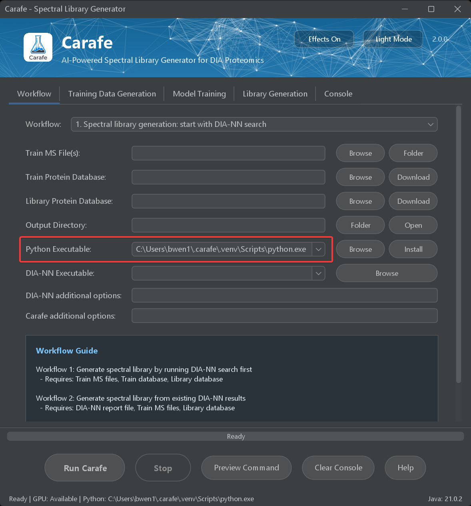
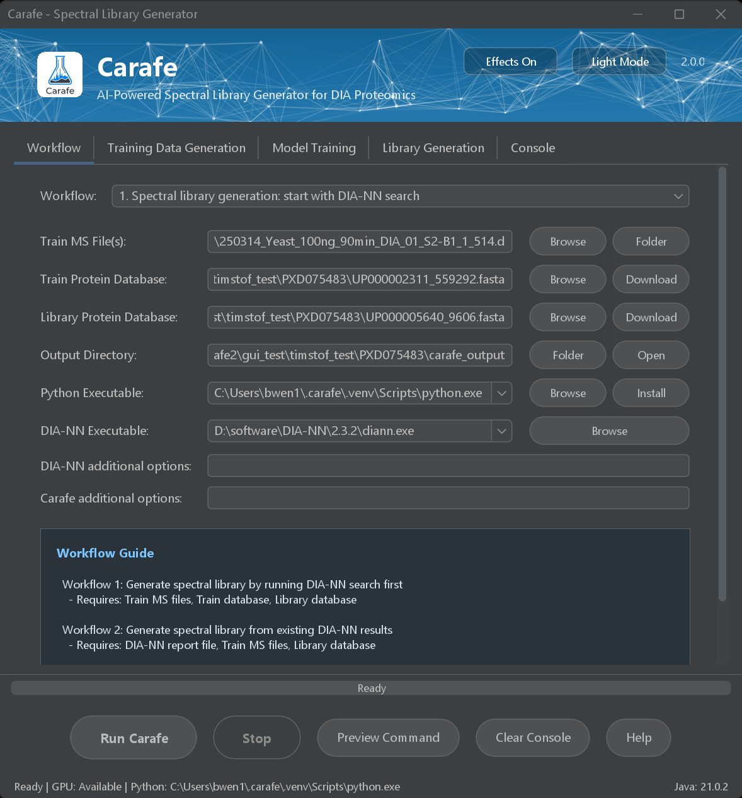
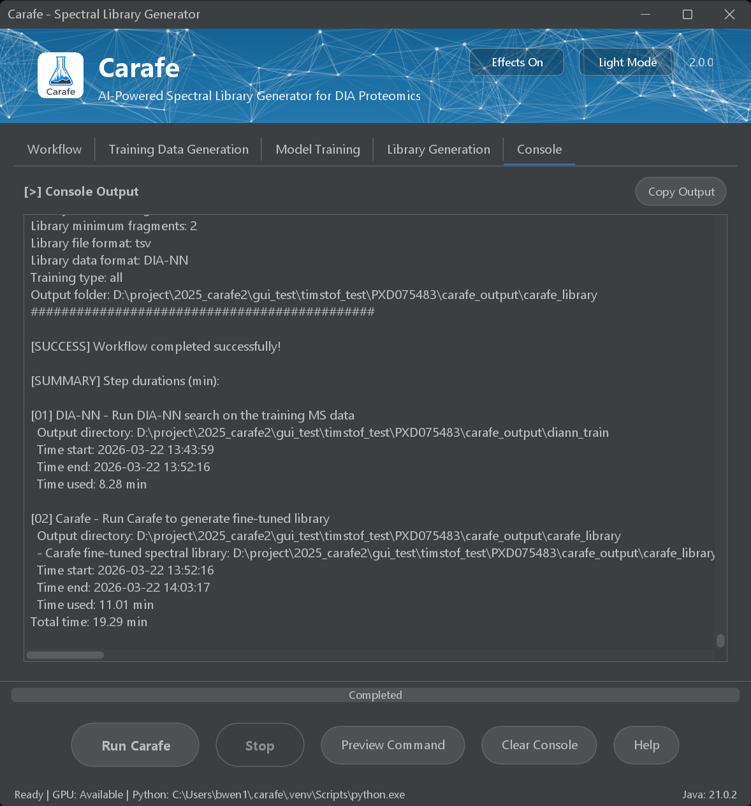
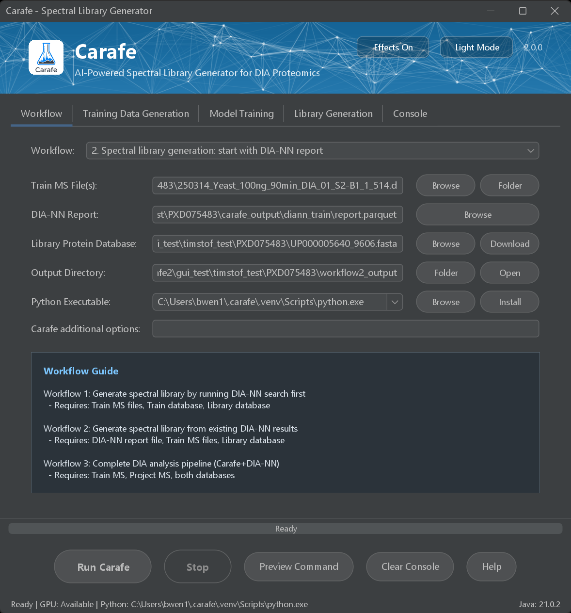
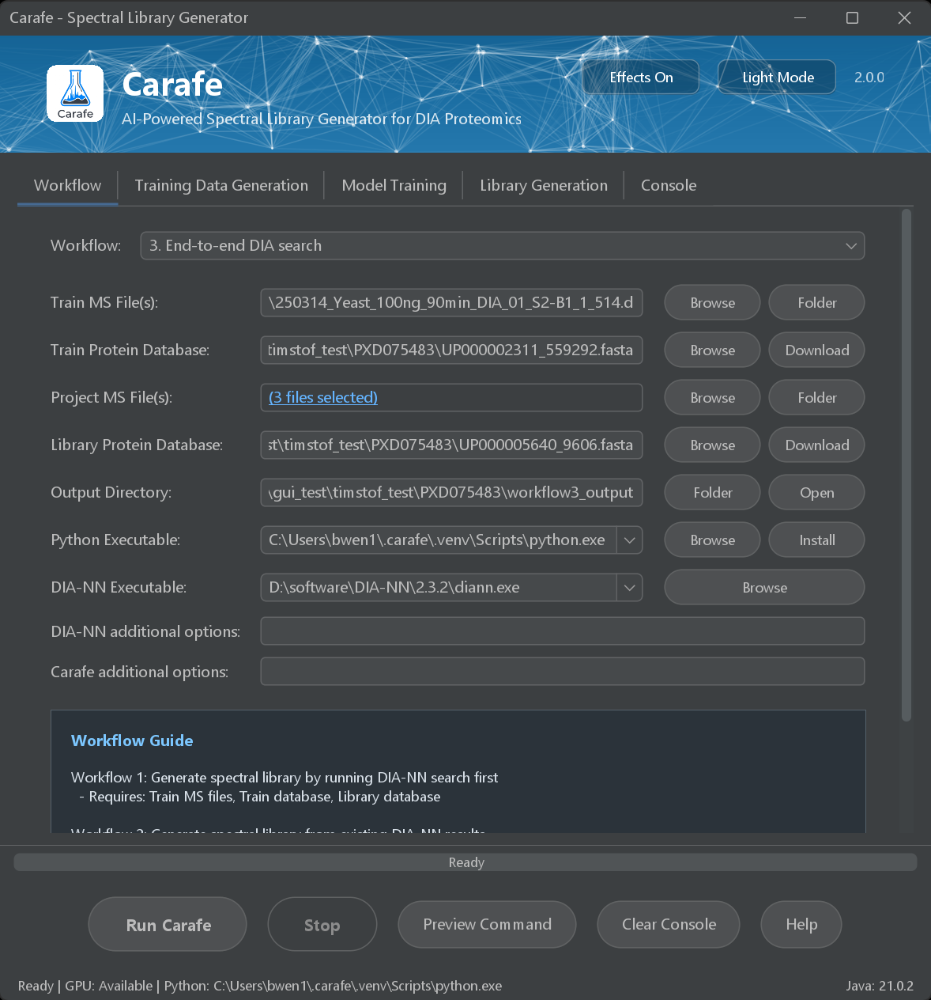
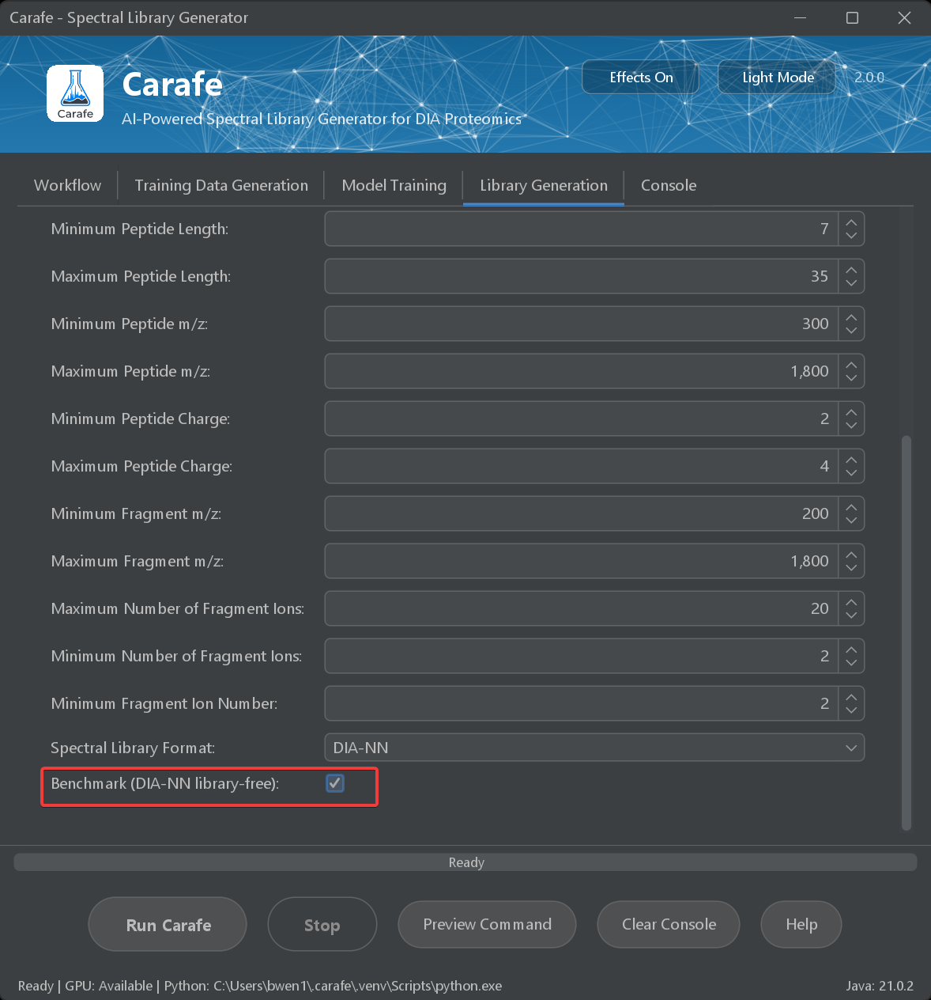
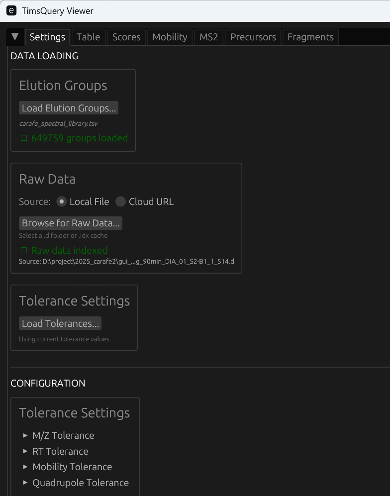
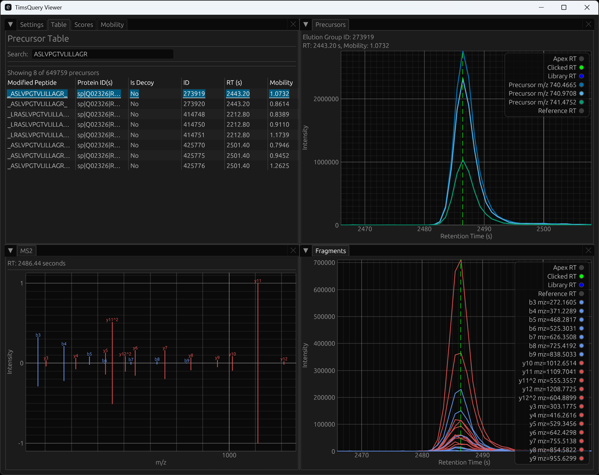

# [Carafe2](https://doi.org/10.1038/s41467-025-64928-4)

 

**Carafe2** is a deep learning-based tool for generating experiment-specific *in silico* spectral libraries for DIA data analysis. It does this by directly training retention time (RT), fragment ion intensity, and, for timsTOF DIA, ion mobility prediction models on DIA data acquired under the experimental conditions of interest. Carafe2 has been tested on DIA data generated from Thermo Fisher Scientific, SCIEX, and Bruker MS instruments. More details about how Carafe2 works are provided in the following manuscript:

Wen, B., Hsu, C., Shteynberg, D. et al. [Carafe enables high quality *in silico* spectral library generation for data-independent acquisition proteomics](https://doi.org/10.1038/s41467-025-64928-4). **Nat Commun** 16, 9815 (2025). 

Wen, B., Paez, J., Hsu, C. et al. [Carafe2 enables high quality *in silico* spectral library generation for timsTOF data-independent acquisition proteomics](). **bioRxiv** 2026. (Coming soon)

## Installation

### Using the Carafe2 graphical user interface (recommended)

Carafe2 also provides a standalone graphical user interface (GUI) for Windows, Linux and macOS. You can install it from the `.msi` (Windows) package available on the [GitHub Releases](https://github.com/Noble-Lab/Carafe/releases) page. For Linux and macOS, use the ZIP package instead. All Python dependencies can be installed through the GUI. After installation on Windows, launch Carafe2 from the Start menu and use the GUI to configure inputs, parameters, and output locations for spectral library generation without using the command line. No Java is required if Carafe2 is installed using the `.msi` installer. For Linux and macOS, Carafe2 can be run using the command line (see below) to launch the GUI.

### Using Carafe2 in Skyline

The Skyline version supporting Carafe2 is available on the Skyline website: [https://skyline.ms/carafe.url](https://skyline.ms/carafe.url).

### Using Carafe2 through the command line 

Carafe2 is written in Java and Python and can run on Windows, macOS, and Linux. To run Carafe2 from the command line, Java and Python must be installed. If Java is not installed, please install Java version 21.0.2 or later from https://jdk.java.net/archive/. After Java is installed, Carafe2 can be downloaded from https://github.com/Noble-Lab/Carafe/releases. All Python dependencies can be installed using the following command:

```shell
# using the installed Java 
java -cp carafe-2.0.0.jar main.java.util.PyInstaller
```

## Usage

### Using the Carafe2 graphical user interface (recommended)

#### Launch the Carafe2 GUI 

##### Windows

After Carafe2 is installed using the `.msi` installer, launch the GUI by clicking the Carafe icon in the Start menu or the desktop shortcut.

##### Linux or macOS

On Linux or macOS, launch the GUI from the command line:

```shell
java -jar carafe-2.0.0.jar
```

The Carafe2 GUI:

 

When opening the Carafe2 GUI for the first time, users need to click the **Install** button shown below to install all required Python dependencies. This typically takes about 1-2 minutes.

 

After the dependencies are installed, the installed Python executable path will be shown in the **Python Executable** field as shown below:

 

The GUI supports three common workflows:

1. Spectral library generation with a DIA-NN search performed within the same workflow; 
2. Spectral library generation from an existing DIA-NN search result;
3. End-to-end DIA analysis using Carafe2 library generation together with DIA-NN for peptide detection and quantification.

#### Workflow 1: Spectral library generation: start with a DIA-NN search

Use this workflow to generate an experiment-specific spectral library starting from a DIA-NN search. It is recommended when you have DIA training data and want Carafe2 to build a library tailored to your experimental data and settings.

The main inputs:

1. **Train MS File(s)**: MS/MS data for model training. Supported formats: mzML, Thermo raw, Bruker raw (.d). A single MS/MS file, multiple MS/MS files, or a folder containing MS/MS files are accepted. When the format is Thermo raw, MSConvert (ProteoWizard) needs to be installed (convert raw to mzML for Carafe);
2. **Train Protein Database**: Protein database or a DIA-NN **in silico** library used for peptide detection on the train MS file(s). Supported formats: FASTA or DIA-NN's speclib (e.g. protein.fasta, protein.fa or *.speclib);
3. **Library Protein Database**: Protein database used for fine-tuned spectral library generation. Supported formats: FASTA (e.g. protein.fasta or protein.fa).

[DIA-NN](https://github.com/vdemichev/DiaNN) needs to be installed for using this workflow. Installed DIA-NN will be automatically detected by Carafe2. If DIA-NN is not installed, please install DIA-NN first and then launch the Carafe2 GUI. If an installed DIA-NN is not detected automatically (i.e., it is not available in the dropdown list of the **DIA-NN Executable** field), please click the **Browse** button to select the DIA-NN executable file (e.g., "diann.exe" on Windows or "diann-linux" on Linux).

In the Carafe2 GUI, hover the mouse pointer over a field label, input box, or button to display a tooltip with additional help about that option.

For parameters shared between Carafe2 library generation and DIA-NN search, such as enzyme, missed cleavages, modification settings, and peptide length, the DIA-NN settings are based on what is set in the Carafe2 **Library generation** panel. For other DIA-NN parameters, the default settings are typically used. Parameters that are not available through the GUI can be added or modified in the **DIA-NN additional options** field in the **Workflow** panel.

Below is an example of the GUI screenshot for spectral library generation with a DIA-NN search. The input MS/MS file is a single timsTOF DIA run from a yeast sample. In this workflow, this single DIA run will be first searched against the train protein database (a yeast protein database file) using DIA-NN (version 2.3.2). Identified precursors passed 1% FDR will be used for Carafe2 fragment ion intensity, retention time and ion mobility models fine-tuning. Then the fine-tuned models will be used in generating an experiment-specific *in silico* spectral library for a human protein database.

 

After all the inputs and parameters are set, click the **Run Carafe** button to start analysis. During the run, console output will be shown in the **Console** panel:



After the run is finished, the output directory will contain the following folders and files:

- `diann_train`: DIA-NN search result folder used for training;
- `carafe_library`: Generated spectral library file (**carafe_spectral_library.tsv**), including the default TSV output format compatible with DIA-NN, model training, data and fine-tuned models;
- `parameter_screenshots`: Screenshots of the GUI parameter settings used for the run;
- `carafe_log.txt`: Analysis log for the run. The log file contains all command lines used for the run.

#### Workflow 2: Spectral library generation: start with DIA-NN report

Use this workflow to generate an experiment-specific spectral library starting from an existing DIA-NN report. It is recommended when you already have DIA-NN search results and want to use them directly for Carafe2 library generation.

In the Carafe2 GUI, hover the mouse pointer over a field label, input box, or button to display a tooltip with additional help about that option.

The main inputs:
1. **DIA-NN Report**: A peptide detection file used for model training. The main report file from DIA-NN (from v1.8.1 to v2.x.x) is supported. Supported formats: tsv, parquet. (e.g. report.tsv or report.parquet). This file must be directly generated using the same input train MS file(s). If DIA-NN version v2.2.0 is used, ``--export-quant`` is needed to add to the command line of DIA-NN search to export "Ms2.Scan" in the main report "report.parquet".
2. **Train MS File(s)**: MS/MS data for model training. Supported formats: mzML, Thermo raw, Bruker raw (.d). A single MS/MS file, multiple MS/MS files, or a folder containing MS/MS files are accepted. When the format is Thermo raw, MSConvert (ProteoWizard) needs to be installed (convert raw to mzML for Carafe);
3. **Library Protein Database**: Protein database used for fine-tuned spectral library generation. Supported formats: FASTA (e.g. protein.fasta or protein.fa).

Below is an example of the GUI screenshot for spectral library generation with a DIA-NN search result file (i.e., a report.parquet file). The input MS/MS file is a single timsTOF DIA run from a yeast sample. In this workflow, the DIA-NN main report file ("report.parquet") was generated by searching the single DIA run against the train protein database (a yeast protein database file) using DIA-NN (version 2.3.2). Identified precursors passed 1% FDR will be used for Carafe2 fragment ion intensity, retention time and ion mobility models fine-tuning. The fine-tuned models will be used in generating an experiment-specific *in silico* spectral library for a human protein database.

 

After all the inputs and parameters are set, click the **Run Carafe** button to start analysis. During the run, console output will be shown in the **Console** panel.

After the run is finished, the output directory will contain the following folders and files:

- `carafe_library`: Generated spectral library file (**carafe_spectral_library.tsv**), including the default TSV output format compatible with DIA-NN, model training, data and fine-tuned models;
- `parameter_screenshots`: Screenshots of the GUI parameter settings used for the run;
- `carafe_log.txt`: Analysis log for the run. The log file contains all command lines used for the run.


#### Workflow 3: End-to-end DIA search

Use this workflow to run an end-to-end DIA-NN search with Carafe2 and DIA-NN. This workflow includes three steps: 1) DIA-NN search on the train MS file(s); 2) Carafe2 model training and experiment-specific **in silico** spectral library generation; 3) DIA-NN search on the project MS file(s) using the Carafe2-generated spectral library.

[DIA-NN](https://github.com/vdemichev/DiaNN) needs to be installed for using this workflow. Installed DIA-NN will be automatically detected by Carafe2. If DIA-NN is not installed, please install DIA-NN first and then launch the Carafe2 GUI. If an installed DIA-NN is not detected automatically (i.e., it is not available in the dropdown list of the **DIA-NN Executable** field), please click the **Browse** button to select the DIA-NN executable file (e.g., "diann.exe" on Windows or "diann-linux" on Linux).

In the Carafe2 GUI, hover the mouse pointer over a field label, input box, or button to display a tooltip with additional help about that option.

The main inputs:

1. **Train MS File(s)**: MS/MS data for model training. Supported formats: mzML, Thermo raw, Bruker raw (.d). A single MS/MS file, multiple MS/MS files, or a folder containing MS/MS files are accepted. When the format is Thermo raw, MSConvert (ProteoWizard) needs to be installed (convert raw to mzML for Carafe);
2. **Train Protein Database**: Protein database or a DIA-NN **in silico** library used for peptide detection on the train MS file(s). Supported formats: FASTA or DIA-NN's speclib (e.g. protein.fasta, protein.fa or *.speclib);
3. **Library Protein Database**: Protein database used for fine-tuned spectral library generation. Supported formats: FASTA (e.g. protein.fasta or protein.fa).
4. **Project MS File(s)**: MS/MS data for peptide detection using the fine-tuned spectral library using DIA-NN. Supported formats: mzML, Thermo raw, Bruker raw (.d). A single MS/MS file, multiple MS/MS files, or a folder containing MS/MS files are accepted. When the format is Thermo raw, users need to make sure DIA-NN is configured to use Thermo raw format.

For parameters shared between Carafe2 library generation and DIA-NN search, such as enzyme, missed cleavages, modification settings, and peptide length, the DIA-NN settings are based on what is set in the Carafe2 **Library generation** panel. For other DIA-NN parameters, the default settings are typically used. Parameters that are not available through the GUI can be added or modified in the **DIA-NN additional options** field in the **Workflow** panel.

Below is an example of the GUI screenshot for the end-to-end DIA analysis. In this workflow, a single yeast timsTOF DIA run will be first searched against the train protein database (a yeast protein database file) using DIA-NN (version 2.3.2). Identified precursors passed 1% FDR will be used for Carafe2 fragment ion intensity, retention time and ion mobility models fine-tuning. Then the fine-tuned models will be used in generating an experiment-specific *in silico* spectral library for a human protein database. In the last step, the project MS file(s) (three human cell line timsTOF DIA runs) will be searched using DIA-NN with the Carafe2-generated spectral library.

 

After all the inputs and parameters are set, click the **Run Carafe** button to start analysis. During the run, console output will be shown in the **Console** panel.

After the run is finished, the output directory will contain the following folders and files:

- `diann_train`: DIA-NN search result folder used for training;
- `carafe_library`: Generated spectral library file (**carafe_spectral_library.tsv**), including the default TSV output format compatible with DIA-NN, model training, data and fine-tuned models;
- `diann_project`: DIA-NN search result folder for the project MS file(s) using the Carafe2-generated spectral library;
- `parameter_screenshots`: Screenshots of the GUI parameter settings used for the run;
- `carafe_log.txt`: Analysis log for the run. The log file contains all command lines used for the run.

For comparison purposes, Workflow 3 also provides the option shown below to perform an additional DIA-NN library-free search on the project MS file(s). This allows users to compare DIA-NN search results obtained with the Carafe2 fine-tuned spectral library against results from a DIA-NN library-free search on the same project data.

 

### Using Carafe2 in Skyline

A tutorial is available at the Skyline website: [Build a Carafe Library in Skyline](https://skyline.ms/carafe.url).

### Using Carafe2 through the command line 

<details>
<summary>Carafe2 command line options</summary>

```
$ java -jar carafe-2.0.0.jar -h
usage: Options
 -i <arg>                 Peptide detection file from DIA-NN (e.g., report.tsv or report.parquet) or
                          Skyline
 -ms <arg>                Training MS data in mzML or Bruker raw (.d) format: a single MS/MS file or a folder containing multiple MS/MS files.
 -fixMod <arg>            Fixed modification, the format is like : 1,2,3. Use '-printPTM' to show
                          all supported modifications. Default is 1
                          (Carbamidomethylation(C)[57.02]). If there is no fixed modification, set
                          it as '-fixMod no' or '-fixMod 0'.
 -varMod <arg>            Variable modification, the format is the same with -fixMod. Default is 2
                          (Oxidation(M)[15.99]). If there is no variable modification, set it as
                          '-varMod no' or '-varMod 0'.
 -maxVar <arg>            Max number of variable modifications, default is 1
 -printPTM                Print all supported PTMs
 -db <arg>                Protein database
 -o <arg>                 Output directory
 -itol <arg>              Fragment ion m/z tolerance in ppm, default is 20
 -itolu <arg>             Fragment ion m/z tolerance unit, default is ppm
 -sg <arg>                The number of data points for XIC smoothing, it's 3 in default
 -nm                      Perform fragment ion intensity normalization or not
 -nf <arg>                The minimum number of matched fragment ions to consider, it's 4 in default
 -cs                      Fragment ion charge less than precursor charge or not
 -ez                      Export fragment ion mz to file or not
 -skyline                 Export skyline transition list file or not
 -valid                   Only export valid matches or not
 -na <arg>                The number of adjacent scans to match: default is 0
 -fdr <arg>               The minimum FDR cutoff to consider, default is 0.01
 -cor <arg>               The minimum correlation cutoff to consider, default is 0.75
 -ptm_site_prob <arg>     The minimum PTM site score to consider, default is 0.75
 -ptm_site_qvalue <arg>   The threshold of PTM site qvalue, default is 1 (no filtering)
 -use_all_peaks           Use all peaks for training
 -min_mz <arg>            The minimum fragment ion m/z to consider, default is 200.0
 -min_n <arg>             The minimum high quality fragment ion number to consider, default is 4
 -enzyme <arg>            Enzyme used for protein digestion. 0:Non enzyme, 1:Trypsin (default),
                          2:Trypsin (no P rule), 3:Arg-C, 4:Arg-C (no P rule), 5:Arg-N, 6:Glu-C,
                          7:Lys-C
 -miss_c <arg>            The max missed cleavages, default is 1
 -I2L                     Convert I to L
 -clip_n_m                When digesting a protein starting with amino acid M, two copies of the
                          leading peptides (with and without the N-terminal M) are considered or
                          not. Default is false.
 -minLength <arg>         The minimum length of peptide to consider, default is 7
 -maxLength <arg>         The maximum length of peptide to consider, default is 35
 -min_pep_mz <arg>        The minimum mz of peptide to consider, default is 400
 -max_pep_mz <arg>        The maximum mz of peptide to consider, default is 1000
 -min_pep_charge <arg>    The minimum precursor charge to consider, default is 2
 -max_pep_charge <arg>    The maximum precursor charge to consider, default is 4
 -lf_type <arg>           Spectral library format: DIA-NN (default), EncyclopeDIA, Skyline (blib) or
                          mzSpecLib
 -lf_format <arg>         Spectral library file format: tsv (default) or parquet
 -lf_frag_mz_min <arg>    The minimum mz of fragment to consider for library generation, default is
                          200
 -lf_frag_mz_max <arg>    The maximum mz of fragment to consider for library generation, default is
                          1800
 -lf_top_n_frag <arg>     The maximum number of fragment ions to consider for library generation,
                          default is 20
 -lf_min_n_frag <arg>     The minimum number of fragment ions to consider for library generation,
                          default is 2
 -lf_frag_n_min <arg>     The minimum fragment ion number to consider for library generation,
                          default is 2
 -rf                      Refine peak boundary or not
 -rf_rt_win <arg>         RT window for refine peak boundary, default is to determine automatically
 -rt_win_offset <arg>     RT window offset for XIC extraction, default is 1 minute
 -rt_max <arg>            The max RT, default is 0.0, meaning using the max RT from the input MS
                          file
 -xic                     Export XIC to file or not
 -export_mgf              Export spectra to a mgf file or not
 -data_type <arg>         DDA or DIA (default)
 -no_masking              No peak masking
 -y1                      Don't use y1 ion in training
 -n_ion_min <arg>         For n-terminal fragment ions (such as b-ion) with number <= n_ion_min,
                          they will be considered as invalid. Default is 0.
 -c_ion_min <arg>         For c-terminal fragment ions (such as y-ion) with number <= n_ion_min,
                          they will be considered as invalid. Default is 0.
 -nce <arg>               NCE for in-silico spectral library
 -ms_instrument <arg>     MS instrument for in-silico spectral library: default is Eclipse
 -device <arg>            device for in-silico spectral library: default is gpu
 -se <arg>                The search engine used to generate the identification result: DIA-NN
 -mode <arg>              Data type: general or phosphorylation
 -tf <arg>                Fine tune type: ms2, rt, all (default)
 -seed <arg>              Random seed, 2024 in default
 -fast                    Save data to parquet format for speeding up reading and writing
 -python <arg>            Path to Python executable
 -mod2mass <arg>          Change the mass of a modification. The format is like: 2@0
 -user_var_mods <arg>     User defined variable modifications
 -ccs                     CCS training
 -model_dir <arg>         The directory of the model to use for spectral library generation
 -ms2_model <arg>         User-provided pretrained MS2 model path
 -verbose <arg>           The level of detail of the log: 1 (info, default), 2 (debug)
 -h                       Help
```
</details>

#### Experiment specific *in silico* spectral library generation using Carafe2 for a DIA experiment using a Thermo Lumos instrument

The following example shows how to generate a spectral library for yeast proteome ([UP000002311_559292.fasta](https://panoramaweb.org/_webdav/Panorama%20Public/2024/MacCoss%20-%20Carafe/%40files/SupplementaryFiles/ProteinDatabases/UP000002311_559292.fasta)). The training DIA data ([Crucios_20240320_CH_15_HeLa_CID_27NCE_01.mzML](https://panoramaweb.org/_webdav/Panorama%20Public/2024/MacCoss%20-%20Carafe/%40files/RawFiles/Lumos/8mz_staggered_reCID/Crucios_20240320_CH_15_HeLa_CID_27NCE_01.mzML)) is a human cell line DIA file and peptide identification is performed using DIA-NN ([report.tsv](https://panoramaweb.org/_webdav/Panorama%20Public/2024/MacCoss%20-%20Carafe/%40files/SupplementaryFiles/SearchResults/Lumos_8mz_staggered_reCID_human/report.tsv)). Carafe2 has been tested on using peptide identification result from DIA-NN search for model training. If DIA-NN version v2.2.0 is used, ``--export-quant`` is needed to add to the command line of DIA-NN search to export "Ms2.Scan" in the main report "report.parquet".

```shell
# please make sure that the carafe2 conda environment is activated (conda activate carafe) before run the following java command line.
java -jar carafe-2.0.0.jar -db UP000002311_559292.fasta -fixMod 1 -varMod 0 -maxVar 1 -o test_ai_all -min_mz 200 -maxLength 35 -min_pep_mz 400 -max_pep_mz 1000 -i report.tsv -ms Crucios_20240320_CH_15_HeLa_CID_27NCE_01.mzML -itol 20 -itolu ppm -nm -nf 4 -ez -skyline -valid -enzyme 2 -miss_c 1 -se DIA-NN -mode general -minLength 7 -lf_type diann -rf -tf all -na 0 -cor 0.8 -lf_top_n_frag 20 -lf_frag_n_min 0 -rf_rt_win 1.5 -n_ion_min 2 -c_ion_min 2 -seed 2000 -lf_min_n_frag 2
```

The output spectral library is in a tsv format compatible with DIA-NN. The content looks like below:

<code>
<pre>
ModifiedPeptide          StrippedPeptide  PrecursorMz        PrecursorCharge  Tr_recalibrated  ProteinID             Decoy  FragmentMz  RelativeIntensity  FragmentType  FragmentNumber  FragmentCharge  FragmentLossType
_KLWWDC[UniMod:4]YWWDR_  KLWWDCYWWDR      571.9258823279321  3                117.52           sp|P39961|TOG1_YEAST  0      476.22522   1.0000             y             3               1               noloss
_KLWWDC[UniMod:4]YWWDR_  KLWWDCYWWDR      571.9258823279321  3                117.52           sp|P39961|TOG1_YEAST  0      662.3045    0.9709             y             4               1               noloss
_KLWWDC[UniMod:4]YWWDR_  KLWWDCYWWDR      571.9258823279321  3                117.52           sp|P39961|TOG1_YEAST  0      825.36786   0.2221             y             5               1               noloss
_KLWWDC[UniMod:4]YWWDR_  KLWWDCYWWDR      571.9258823279321  3                117.52           sp|P39961|TOG1_YEAST  0      290.1459    0.1924             y             2               1               noloss
_KLWWDC[UniMod:4]YWWDR_  KLWWDCYWWDR      571.9258823279321  3                117.52           sp|P39961|TOG1_YEAST  0      889.4025    0.1285             b             6               1               noloss
_KLWWDC[UniMod:4]YWWDR_  KLWWDCYWWDR      571.9258823279321  3                117.52           sp|P39961|TOG1_YEAST  0      729.3719    0.1169             b             5               1               noloss
_KLWWDC[UniMod:4]YWWDR_  KLWWDCYWWDR      571.9258823279321  3                117.52           sp|P39961|TOG1_YEAST  0      428.26562   0.0727             b             3               1               noloss
_KLWWDC[UniMod:4]YWWDR_  KLWWDCYWWDR      571.9258823279321  3                117.52           sp|P39961|TOG1_YEAST  0      1052.4658   0.0624             b             7               1               noloss
_KLWWDC[UniMod:4]YWWDR_  KLWWDCYWWDR      571.9258823279321  3                117.52           sp|P39961|TOG1_YEAST  0      614.3449    0.0437             b             4               1               noloss
</pre>
</code>


The above example command line took about 8 minutes on a Linux server (CPU: 36 threads, 128G RAM) using GPU (one Nvidia Quadro RTX4000): set parameter **-device gpu**. It took less than 14 minutes using CPU only on the same server: set parameter **-device cpu**.


#### Experiment specific *in silico* spectral library generation using Carafe2 for a timsTOF DIA experiment using a Bruker Ultra 2 instrument

The following example shows how to generate a spectral library for yeast proteome ([UP000002311_559292.fasta](https://panoramaweb.org/_webdav/Panorama%20Public/2024/MacCoss%20-%20Carafe/%40files/SupplementaryFiles/ProteinDatabases/UP000002311_559292.fasta)). The training DIA data files ([timsTOF Ultra 2 - human cell lines](https://panoramaweb.org/_webdav/Panorama%20Public/2026/MacCoss%20-%20Carafe2/%40files/RawFiles/global_proteome/human/)) are three replicate DIA runs from human Hela cell lines and peptide identification is performed using DIA-NN ([report.parquet](https://panoramaweb.org/_webdav/Panorama%20Public/2026/MacCoss%20-%20Carafe2/%40files/RawFiles/DIANN/global_proteome/human/report.parquet)). Carafe2 has been tested on using peptide identification result from DIA-NN search for model training. If DIA-NN version v2.2.0 is used, ``--export-quant`` is needed to add to the command line of DIA-NN search to export "Ms2.Scan" in the main report "report.parquet".

```shell
java -jar carafe-2.0.0.jar -i report.parquet -ms 250314_HeLa_100ng_90min_DIA_01_S2-A1_1_507.d -db UP000002311_559292.fasta -o ./test_ai_all -fast -fixMod 1 -varMod 0 -maxVar 1 -min_mz 200 -maxLength 35 -min_pep_mz 400 -max_pep_mz 1000 -itol 15 -itolu ppm -nm -nf 4 -ez -skyline -valid -enzyme 2 -miss_c 1 -se "DIA-NN" -mode general -minLength 7 -lf_type diann -rf -tf all -na 0 -cor 0.8 -lf_top_n_frag 20 -lf_frag_n_min 2 -rf_rt_win 1.0 -n_ion_min 2 -c_ion_min 2 -ccs -xic -clip_n_m 
```

The output spectral library is in a tsv format compatible with DIA-NN. The content looks like below:

<code>
<pre>
ModifiedPeptide  StrippedPeptide  PrecursorMz       PrecursorCharge  Tr_recalibrated  IonMobility  ProteinID             Decoy  FragmentMz  RelativeIntensity  FragmentType  FragmentNumber  FragmentCharge  FragmentLossType
_RLGLQGR_        RLGLQGR          400.248486282602  2                5.08             0.7959       sp|P38876|PTH_YEAST   0      530.3045    1.0000             y             5               1               noloss
_RLGLQGR_        RLGLQGR          400.248486282602  2                5.08             0.7959       sp|P38876|PTH_YEAST   0      643.3886    0.9583             y             6               1               noloss
_RLGLQGR_        RLGLQGR          400.248486282602  2                5.08             0.7959       sp|P38876|PTH_YEAST   0      440.29797   0.5160             b             4               1               noloss
_RLGLQGR_        RLGLQGR          400.248486282602  2                5.08             0.7959       sp|P38876|PTH_YEAST   0      568.35657   0.3625             b             5               1               noloss
_RLGLQGR_        RLGLQGR          400.248486282602  2                5.08             0.7959       sp|P38876|PTH_YEAST   0      625.378     0.2991             b             6               1               noloss
_RLGLQGR_        RLGLQGR          400.248486282602  2                5.08             0.7959       sp|P38876|PTH_YEAST   0      360.199     0.1833             y             3               1               noloss
_RLGLQGR_        RLGLQGR          400.248486282602  2                5.08             0.7959       sp|P38876|PTH_YEAST   0      327.21393   0.1831             b             3               1               noloss
_RLGLQGR_        RLGLQGR          400.248486282602  2                5.08             0.7959       sp|P38876|PTH_YEAST   0      473.28305   0.1648             y             4               1               noloss
_RLGLQGR_        RLGLQGR          400.248486282602  2                5.08             0.7959       sp|P38876|PTH_YEAST   0      232.14041   0.0772             y             2               1               noloss
_RLGLQGR_        RLGLQGR          400.248486282602  2                5.08             0.7959       sp|P38876|PTH_YEAST   0      270.19244   0.0343             b             2               1               noloss
</pre>
</code>


The above example command line took about 14 minutes on a Linux server (CPU: 36 threads, 128G RAM) using GPU (one Nvidia Quadro RTX4000): set parameter **-device gpu**. It took less than 52 minutes using CPU only on the same server: set parameter **-device cpu**.


##### Modifications supported in Carafe2

The following modifications have been tested in Carafe2:
Carbamidomethylation(C) as fixed modification and Oxidation(M), Phosphorylation (STY) as variable modifications.

Add parameter setting ``-fixMod 1`` to set **Carbamidomethylation(C)** as the fixed modification in Carafe2. Add parameter setting ``-varMod 2`` to set **Oxidation(M)** as a variable modification. Add parameter setting ``-varMod 7,8,9`` to set **Phosphorylation(STY)** as a variable modification. Add parameter setting ``-varMod 2,7,8,9`` to set both **Phosphorylation(STY)** and **Oxidation(M)** as variable modifications. When variable modification is considered, ``-maxVar`` is recommended to set as ``-maxVar 1``: the max number of variable modifications allowed for each peptide is 1. For **phosphorylation**, the command line parameter ``-mode`` needs to set as ``-mode phosphorylation``.

#### *In silico* spectral library generation using Carafe2 with pretrained DDA models from AlphaPeptDeep

The following example shows how to generate a spectral library for yeast proteome ([UP000002311_559292.fasta](https://panoramaweb.org/_webdav/Panorama%20Public/2024/MacCoss%20-%20Carafe/%40files/SupplementaryFiles/ProteinDatabases/UP000002311_559292.fasta)) **without fine-tuning pretrained models using DIA data**. No DIA data is required.

```shell
java -jar carafe-2.0.0.jar -db UP000002311_559292.fasta -fixMod 1 -varMod 0 -maxVar 1 -o test_ai_all -min_mz 200 -maxLength 35 -min_pep_mz 400 -max_pep_mz 1000 -enzyme 2 -miss_c 1 -mode general -minLength 7 -lf_type diann -lf_top_n_frag 20 -lf_frag_n_min 2 -nce 27 -ms_instrument Lumos -seed 2000
```

The output spectral library is in a tsv format compatible with DIA-NN.

The above example command line took about 3 minutes on a Linux server (CPU: 36 threads, 128G RAM) using GPU (one Nvidia Quadro RTX4000): set parameter **-device gpu**. It took about 6 minutes using CPU only on the same server: set parameter **-device cpu**.

#### A Nextflow workflow for *in silico* spectral library generation using Carafe

A Nextflow workflow is also available to run Carafe for *in silico* spectral library generation. The workflow is available at https://nf-carafe-ai-ms.readthedocs.io. The workflow is built using [Nextflow](https://www.nextflow.io/) and [Docker](https://www.docker.com/). It is developed to go from a DIA RAW MS/MS file to an experiment-specific *in silico* spectral library for DIA data analysis. The following input files are typically required to run the workflow:

```
1. A DIA MS/MS file generated using an experiment setting of interest. Both ".raw" and ".mzML" formats are supported.
2. A protein database in FASTA format used for peptide detection on the DIA file;
3. A protein database in FASTA format used for in silico spectral library generation.
4. A parameter file.
```

The workflow can be run on both Windows and Linux systems. It can also be run on both local computer and cloud computer ([AWS](https://aws.amazon.com/)). GPU is not needed to run this workflow.

Details are available at https://nf-carafe-ai-ms.readthedocs.io.

### Visualize timsTOF DIA data with fine-tuned spectral libraries from Carafe2

Timsviewer allows users to visualize the extracted ion chromatograms (XICs) for both peptide precursors and their corresponding fragment ions from Carafe2-generated spectral libraries against a timsTOF DIA data file. Timsviewer is available at https://github.com/TalusBio/timsbuktoolkit/releases.

The main inputs:

1. **timsTOF DIA data file**: A single timsTOF DIA run in Bruker raw format (.d) is supported.
2. **spectral library**: A Carafe2-generated spectral library file in tsv format compatible with DIA-NN.

 

Below is an example screenshot of the Timsviewer visualization of a timsTOF DIA data file with a Carafe2-generated spectral library. The XICs for both precursor and fragment ions are shown in the viewer.

 

## How to cite:

Wen, B., Hsu, C., Shteynberg, D. et al. [Carafe enables high quality *in silico* spectral library generation for data-independent acquisition proteomics](https://doi.org/10.1038/s41467-025-64928-4). **Nat Commun** 16, 9815 (2025). 

Wen, B., Paez, J., Hsu, C. et al. [Carafe2 enables high quality *in silico* spectral library generation for timsTOF data-independent acquisition proteomics](). **bioRxiv** 2026.
